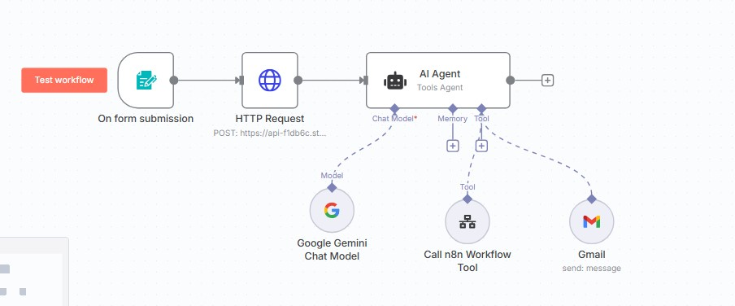
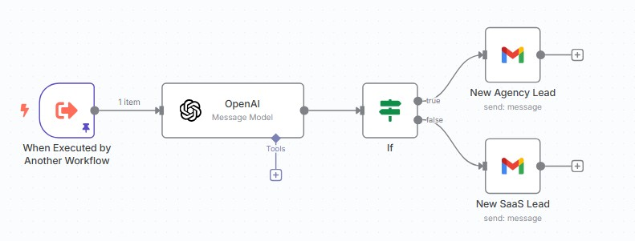

# AI-Lead-Qualification-Agent
Automatically qualify, classify, and respond to leads using AI — no code required. This project uses **n8n**, ** No-Code AI Lead Qualification Agent (n8n + LLMs)Google Gemini/OpenAI**, **Relevance AI/Firecrawl**, and **Gmail** to create an intelligent lead handling workflow.

---
### 🚀 Try the Lead Qualification Agent

📝 [Click here to submit a lead form](https://pradeep2024.app.n8n.cloud/form/86dd93a1-5923-48c1-8810-00392ad099a2)

)

---
## 📌 Features

- 🔄 Form trigger → Research company info via Firecrawl/Relevance AI
- 🧠 Use Gemini or OpenAI to evaluate lead quality based on prompt rules
- 🔗 If qualified → classify into SaaS or Agency and route via Gmail
- 🚫 If unqualified → respond with a partner suggestion
- 🧩 All built visually in n8n (no coding required)

---

## 🧰 Tech Stack

- **n8n** – Visual workflow builder
- **Google Gemini / OpenAI** – AI reasoning
- **Firecrawl / Relevance AI** – Company intelligence
- **Gmail API** – Automated follow-up
- **HTTP Request Nodes** – Integration glue

---

## 📂 Folder Structure

| Folder | Description |
|--------|-------------|
| `/workflows` | Exported `.json` files of the n8n workflows |
| `/docs` | Architecture diagrams, prompt templates, and usage notes |
| `/examples` | Example input/output data for testing |
| `/assets` | Visual assets (workflow screenshots etc.) |

---

## 🚀 How to Use

1. Clone this repo and import `.json` files into your n8n instance.
2. Set your environment variables/API keys:
   - Relevance AI
   - Google Gemini / OpenAI
   - Gmail API
3. Update prompts in `docs/prompt-design.md` as needed.
4. Deploy workflows and test with form submission.

---

## 🧠 Use Case

Inbound leads fill out a form. Your agent:
1. Scrapes and analyzes their company site.
2. Uses an LLM to qualify or reject.
3. If qualified, sends internal notifications with classification.
4. If unqualified, replies with external partner suggestions.

---

## 🖼 Architecture

---
### 🔄 Workflow 1: Lead Qualification

This workflow takes new lead data from a form and uses AI to qualify the lead.

---

### 🧠 Workflow 2: Lead Classification & Notification

If the lead is qualified, the AI classifies them and sends the result to the right email channel.

---
### 📥 Example Input

A visitor submits the following via the lead form:

- **Name**: Jane Doe  
- **Email**: jane@coolstartup.com  
- **Company Website**: https://coolstartup.com  
- **Message**: "We’re exploring ways to automate marketing analytics for our SaaS platform."

---

### ✅ AI Agent Response

- Scraped company website using Firecrawl + Relevance AI.
- Detected SaaS keywords and mid-size org info.
- AI determines **Qualified Lead** ✅.

---

### ✉️ Outcome

- Called Workflow 2
- Lead was classified as **SaaS Lead**
- Email sent to saas-leads@yourcompany.com with summary.

## 🪪 License

MIT
